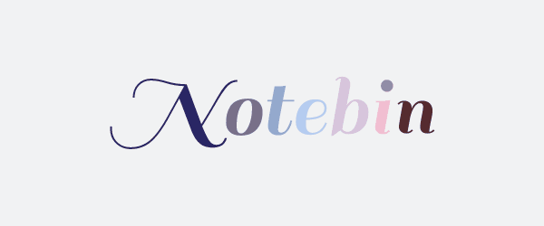

<div align = "center">

 </div>
<div align="center">

[](https://www.python.org/)

[](https://www.javascript.org/)

<br>

</div>

------------------------------------------

> **NoteBin** provides a easy way to manage your notes. Use public notes for general use or log in for private stuff.

> This project does not require any proprietary API or product. 

</div>

------------------------------------------

### Features

* [x] Allows you to take notes, maintain private and public notes.
* [x] Login and sessions
* [x] Character and word count
* [x] Take notes
* [x] Syntax highlighting
* [ ] Improve UI
* [ ] Search bar
* [ ] Share notes 
* [ ] Live syntax highlighting 

------------------------------------------
------------------------------------------

### Installation and Deployment

* Using docker-compose

``` sh
        $ docker-compose up
```

* Using python

``` sh
        $ cd app/
        $ pip3 install -r requirements.txt
        $ python manage.py makemigrations
        $ python manage.py migrate
        $ python manage.py collectstatic --noinput
        $ python manage.py runserver 0.0.0.0:8000
```

### Contributing

 We're are open to `enhancements` & `bug-fixes` :smile: 

### Note

 This project was done under `12 hours with minimal pre-preparation` 

------------------------------------------

### Contributors

* [@Rusherrg](https://github.com/RusherRG)
* [@hetzz](https://github.com/hetzz)
* [@aditya1999](https://github.com/aditya1999)

------------------------------------------

This repository / project was a part of the django audit course in college.
